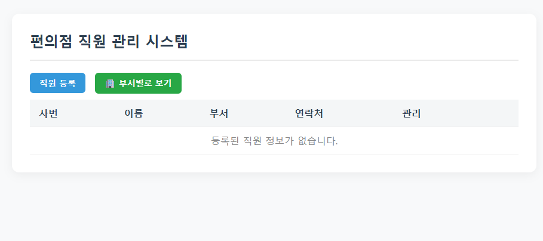
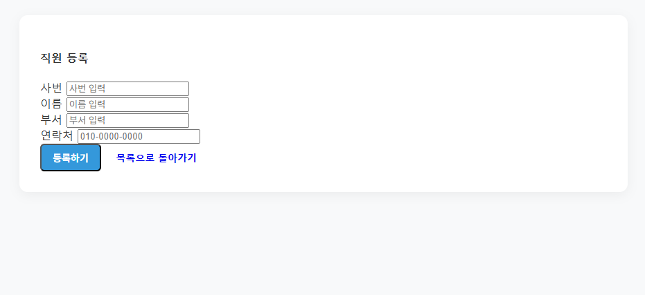
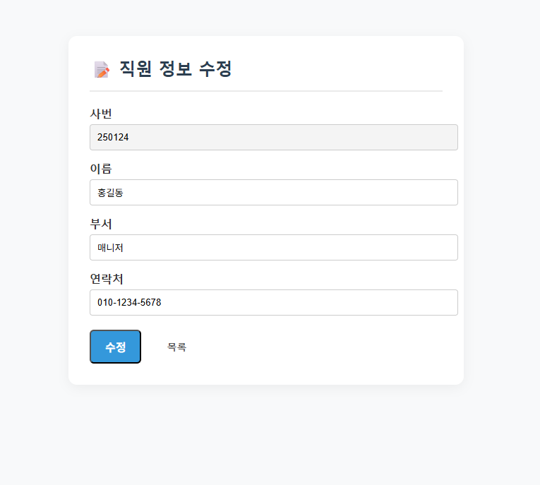
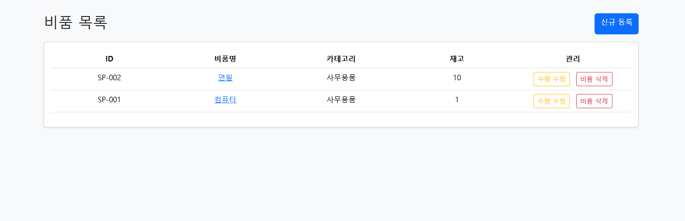
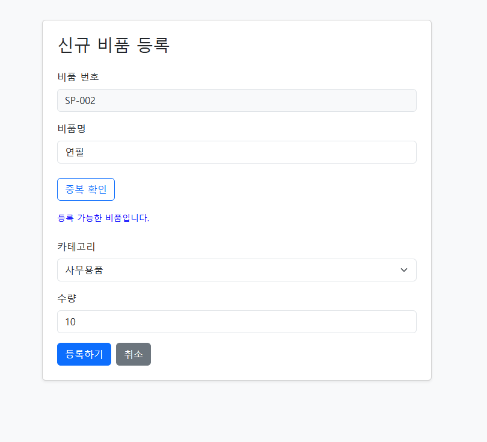
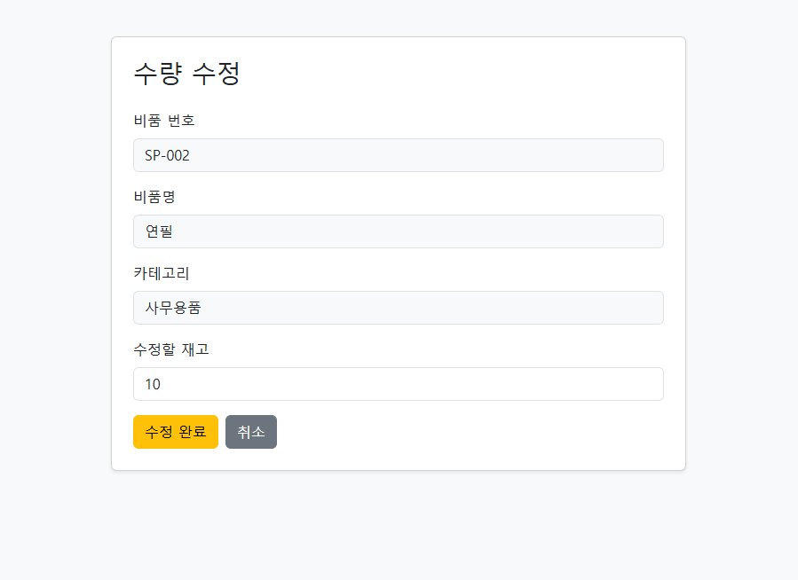
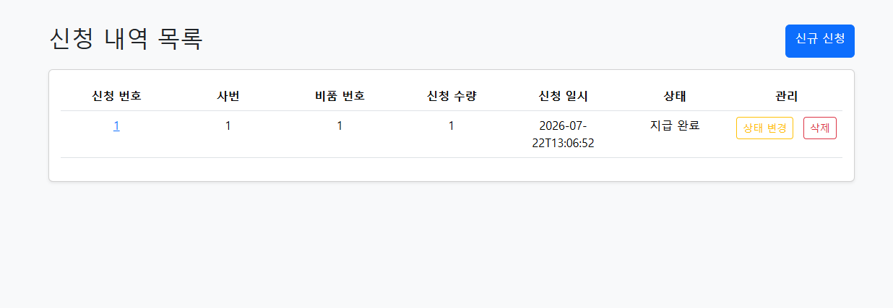
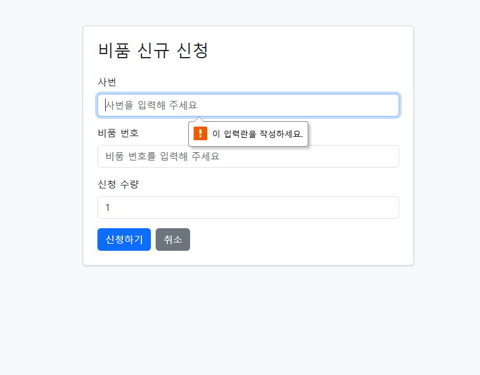

# 팀 프로젝트
### 비품 관리 프로그램 구현

---

# 간략한 프로젝트 소개
본 프로젝트는 비품을 체계적으로 관리하기 위해 제작한 프로그램입니다.
 
비품을 등록, 조회할 수 있으며, 수정 및 삭제 기능을 통해 비품을 효율적으로 관리할 수 있습니다.

---

# 사용 기술
- javascript
- html
- css
- oracle
- spring boot
- mybatis
- thymeleaf
- bootstrap
- git
- github

---

# 팀원 역할
|이름| 담당 영역 |
|---|-------|
|장호영| 직원테이블 |
|이상경| 비품테이블 |
|정진솔| 주문테이블 |

---

# 프로젝트 내부 사진
## employee 직원 테이블

## supply 비품 테이블

## order 주문 테이블

# 각 테이블별 기능
## employee
직원 등록
(사번, 이름, 부서, 연락처 미입력시 경고 문구 출력, 목록으로 돌아가기 입력)
부서별로 보기, 전체 목록 돌아가기 활성화
직원 정보 수정, 삭제시 경고 문구 출력
## supply
비품 등록
(비품 번호 자동 입력, 비품명, 카테고리, 수량 미입력시 경고 문구 나옴,
비품명 중복 확인)
비품 삭제시 경고 문구 출력
비품 수량 수정
## order
비품 등록(사번, 비품 번호 미입력시 경고문 출력)